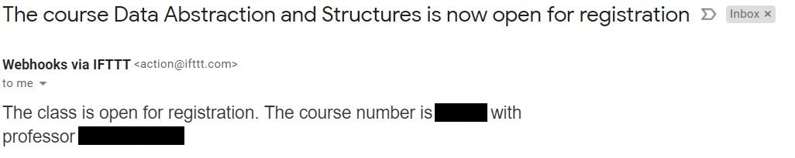

# Course availability checker
## This script checks every hour, if the user specified course is open for registration.
## Once the course availability status changes to open registration an email is sent to the user, and the script ends.

## This is an example of the email notification.

